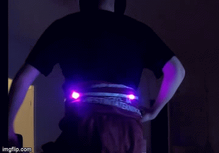

# Haalariledit


Projektissa tehtiin prototyyppi ledeistä, jotka liitettäisiin opiskelijahaalareihin
Ledinauhassa on 60 lediä, joista päällä on neljä eri ilmansuuntiin. MPU6050 gyroskoopilla saamme pohjoisen ilmansuunnan selville arduinolle, jonka avulla saamme simppelillä koodilla ledit päälle.
```
            vihtu = ypr[0] * 180/M_PI;
            val = vihtu / 6 + 30;
            Serial.println(vihtu / 6 + 30);
            strip.setPixelColor(val, 255, 0, 255);
            val1 = val +30;
            val2 = val +15;
            val3 = val -15;
            if (val > 30) {
              val1 = val1 - 60;
              if (val > 45) {
              val2 = val2 - 60;
              }
            }
            else if (val < 15) {
              val3 = val3 + 60;
            }
            
            strip.setPixelColor(val1, 255, 0, 255, 20);
            strip.setPixelColor(val2, 255, 0, 255, 20);
            strip.setPixelColor(val3, 255, 0, 255, 20);
            strip.show();

```
Komponentit:
- Arduino UNO
- MPU6050 Accelerometer and Gyroscope
- WS2812B Led Strip
- Power Bank
